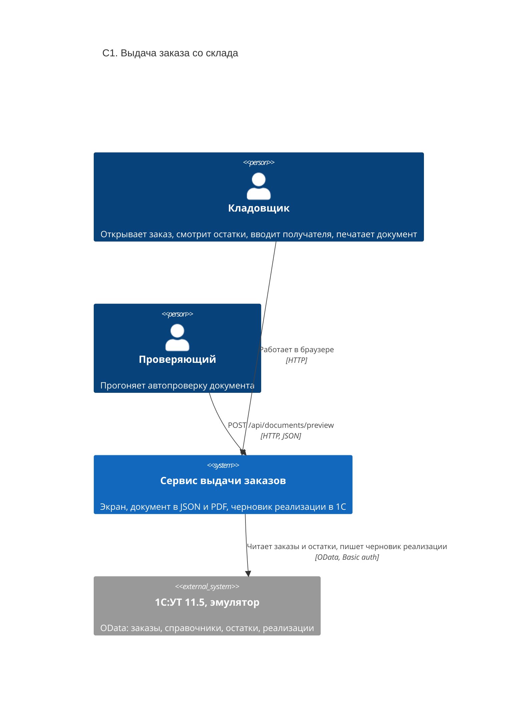

# C1. Контекст системы

## Что важно на этом уровне

- 1С чужая: исходников нет, починить под себя нельзя. Опубликован только OData, конфигуратор не подключить.
- Учётная запись 1С общая для всех кандидатов. Пять неудачных входов блокируют её на пять минут для всех.
- Данные получателя (ФИО, телефон, почта) живут только в запросе: не сохраняются ни у нас, ни в журнале, ни в 1С.
