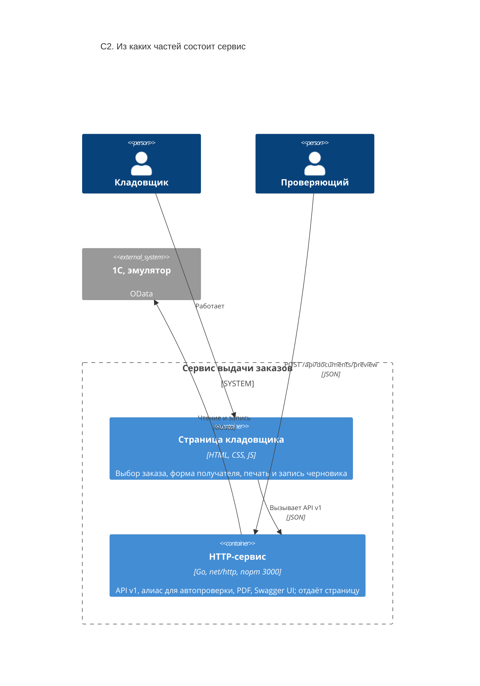

# C2. Контейнеры

| Контейнер | Запуск | Состояние |
|---|---|---|
| HTTP-сервис | `docker compose up` или `go run ./cmd/server` | ничего не хранит: данные читаются из 1С на каждый запрос |
| Страница | вшита в сервис, открывается по `/` | в браузере, до перезагрузки |
