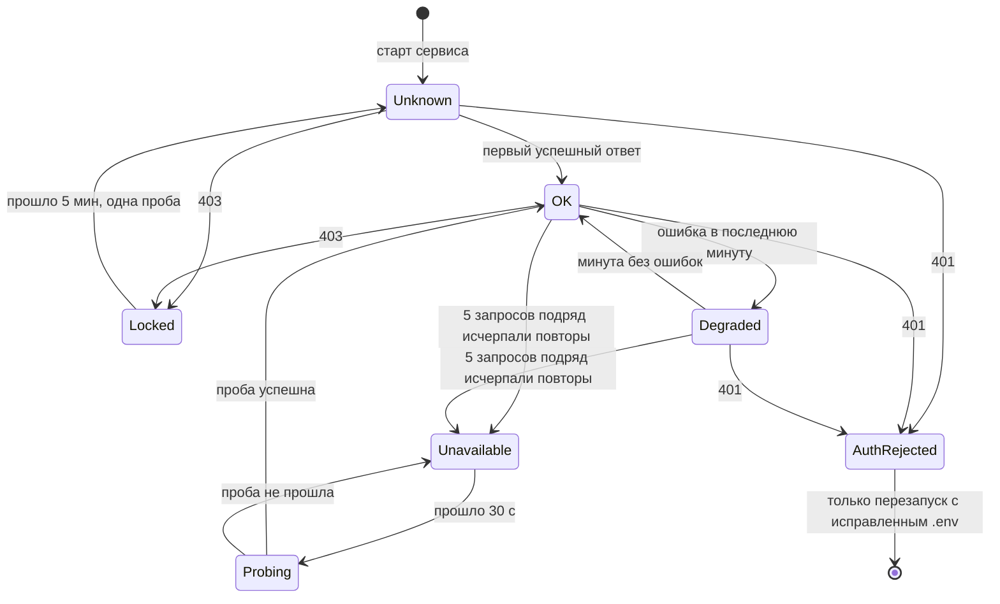

# Деградация при сбоях 1С

Принцип: наш сервис не падает из-за 1С. Страница, форма и проверка полей работают и без неё. Отключается только то, что требует свежих данных 1С, и на экране написано почему. Когда 1С оживает, работа возобновляется сама.

## Ступени

| Ступень | Признак | Что видит кладовщик | Что работает |
|---|---|---|---|
| 0. Норма | — | всё | всё |
| 1. Случайные сбои | единичные `503` | ничего: повторы гасят сбой, операция чуть дольше | всё; в логе предупреждение о повторе |
| 2. Перегрузка | `429` | если укладываемся в дедлайн — просто медленнее; иначе «1С просит подождать N с», кнопка «Повторить» включится по таймеру | всё |
| 3. 1С недоступна | размыкатель открыт | баннер «1С не отвечает, следующая проба через N с»; список и заказ не загружаются, печать выключена | страница, форма, введённые данные, проверка полей |
| 3б. Печать прошла, запись нет | ошибка записи черновика | «PDF готов, черновик в 1С не записан: причина. [Повторить запись]» | повтор записи безопасен ([ADR 0004](../adr/0004-one-shipment-draft-per-order.md)) |
| 4. Неверный логин или пароль | защёлка после `401` | «1С отклонила логин или пароль, проверьте .env и перезапустите сервис» | в 1С не уходит ни одного запроса |
| 4б. Учётка заблокирована | `403` | «Учётная запись 1С заблокирована, проба через N мин» | через 5 минут одна проба |

## Состояния связи с 1С

`Unknown` — пока логин не подтверждён, запросы к 1С идут строго по одному ([ADR 0008](../adr/0008-circuit-breaker-and-auth-latch.md)).

## Что сервис делает сам, независимо от 1С

- паника в обработчике даёт ответ 500 в формате problem+json без стектрейса, процесс продолжает работать;
- у HTTP-сервера таймауты чтения, записи и простоя, размер тела запроса ограничен;
- при остановке (SIGTERM) сервер дожидается текущих запросов;
- проверка полей получателя выполняется до обращения к 1С, поэтому ошибки ввода видны даже при лежащей 1С.

## Где проверено

| Ступень | Тест |
|---|---|
| 1 | `onec`: 503, 503, 200 → успех с паузами 1 и 2 с |
| 2 | `onec`: 429 с `Retry-After` → ожидание; `Retry-After` за дедлайном → сразу `ONEC_RATE_LIMITED` |
| 3 | `onec`: 5 провалов → `ONEC_CIRCUIT_OPEN` без запроса; проба после паузы восстанавливает работу |
| 3б | сценарий записи черновика: неоднозначный `503` → поиск перед повтором |
| 4 | `onec`: 401 → защёлка, 10 параллельных запросов → 1 дошёл до сервера |
| 4б | `onec`: 403 → `ONEC_ACCOUNT_LOCKED`, повторных запросов нет |
| все | e2e против мока в хаос-режимах (этап 10) |
